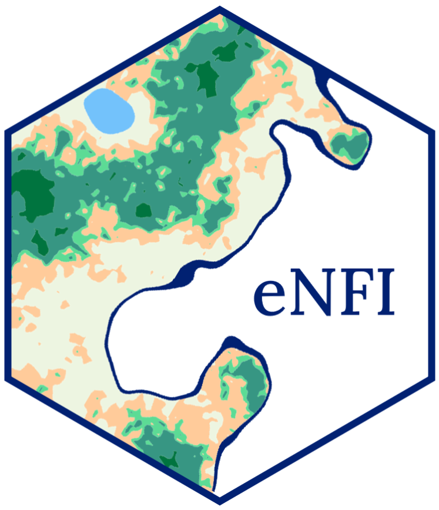
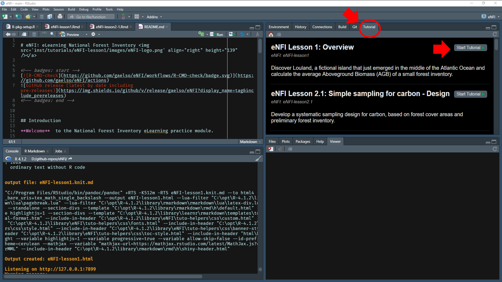

# eNFI: eLearning National Forest Inventory 


<!-- badges: start -->
[](https://github.com/gaelso/eNFI/actions)

<!-- badges: end -->


## Introduction

**Welcome**  to the National Forest Inventory eLearning practice module.

This interactive module is designed to complement the [NFI eLearning modules](https://bit.ly/3m5VEsE) with practical hands-on exercises. These exercises take place on a fictional island that just emerged in the middle of the Atlantic Ocean: `Louland`.

It features interactive lessons designed to practice National Forest Inventory (NFI) sampling and the exploratory analysis of NFI field data with the [R programming language](https://www.r-project.org/). Although this fictional land is not an official country, we will use the acronym NFI when referring to its forest inventory as the method and formulas applied here are valid for nationwide forest inventories.


<br>

## Pre-requisite: 

If you don’t have any experience of programming languages and of R in particular, we strongly recommend you go through an introduction to R before you complete this module. There are plenty of resources freely available on the internet but if you don’t know where to start, and since a good amount of our code is based on the tidyverse collection of R packages, you could try [R for Data Science](https://r4ds.had.co.nz/). The introduction will guide you through installing R, R studio, key packages and the main functions that you will also use here for data wrangling. 

A fair amount of code is related to spatial analysis and spatial data visualization. The online book [Geocomputation with R](https://geocompr.robinlovelace.net/) is a good place to get more information and a deeper understanding on some of the functions used here.  


<br>

## How to use

The interactive lessons are available with a R package: `eNFI`. 


We assume that you have already an updated version of R (R >= 3.5) and Rstudio running on your computer. 

---

**This package is not ready for launch, stay tuned for the version 1.0!**

The current package version number is v0.1.0, this is a pre-release with the lessons 1 and 2.1 for internal review only. 

To install:

- Install the package from Github:

```r
install.packages("remotes")
remotes::install_github("gaelso/eNFI@v0.1.0")

```
- Restart Rstudio.

- If you didn't have the package `learnr` installed beforehand, a new tab "Tutorial" is created in the top-right panel, where you can start the eNFI lessons:





- Alternatively, you can start the lessons from the console:

```r
learnr::run_tutorial("eNFI-lesson1", "eNFI")
learnr::run_tutorial("eNFI-lesson2.1", "eNFI")

```

--- 


<br>

Developed with [learnr](https://rstudio.github.io/learnr/).

Design elements inspired by this R based [online course](https://github.com/tinystats/teacups-giraffes-and-statistics).

<!--
Cover Photo by <a href="https://unsplash.com/@jeremybezanger?utm_source=unsplash&utm_medium=referral&utm_content=creditCopyText">Jeremy Bezanger</a> on <a href="https://unsplash.com/?utm_source=unsplash&utm_medium=referral&utm_content=creditCopyText">Unsplash</a>
-->

<br>

<a rel="license" href="http://creativecommons.org/licenses/by-nc-nd/4.0/"></a>
<br />
This work is licensed under a <a rel="license" href="http://creativecommons.org/licenses/by-nc-nd/4.0/">Creative Commons Attribution-NonCommercial-NoDerivatives 4.0 International License</a>.

