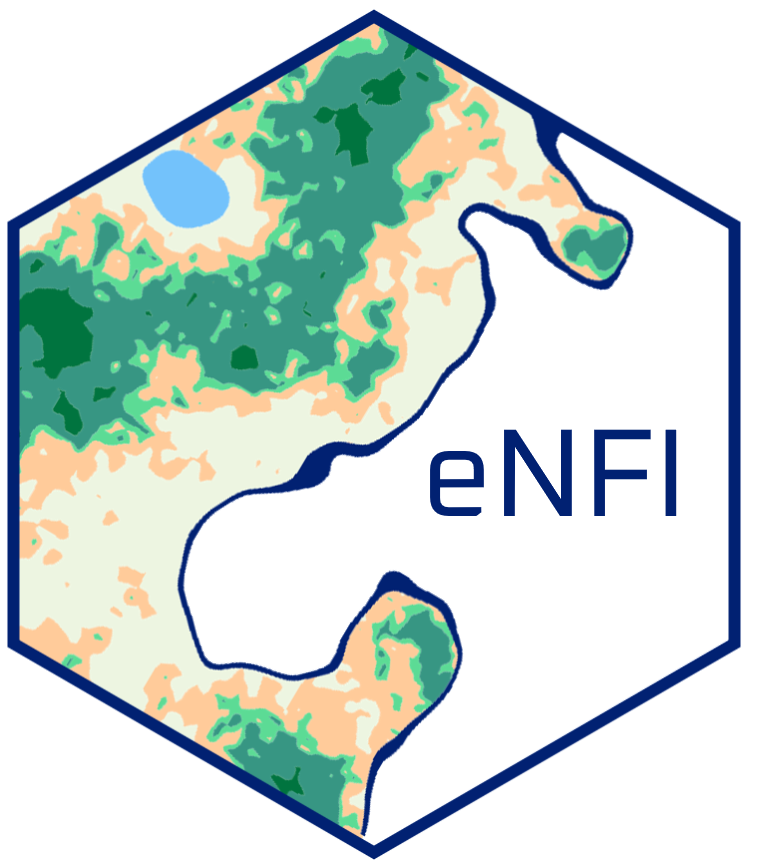

# eNFI: National Forest Inventory eLearning </a>

## Introduction

**Welcome**  to the National Forest Inventory eLearning practice module.

This interactive module is designed to complement the [NFI eLearning modules](https://bit.ly/3m5VEsE) with practical hands-on exercises. These exercises take place on a fictional island that just emerged in the middle of the Atlantic Ocean: `Louland`.

It features interactive lessons designed to practice National Forest Inventory (NFI) sampling and the exploratory analysis of NFI field data with the [R programming language](https://www.r-project.org/). Although this fictional land is not an official country, we will use the acronym NFI when referring to its forest inventory as the method and formulas applied here are valid for nationwide forest inventories.

 

## How to use

**TBD**

 

Developed with [learnr](https://rstudio.github.io/learnr/).

 

Design elements inspired by this R based [online course](https://github.com/tinystats/teacups-giraffes-and-statistics).

 

 
This work is licensed under a <a rel="license" href="http://creativecommons.org/licenses/by-nc-nd/4.0/">Creative Commons Attribution-NonCommercial-NoDerivatives 4.0 International License</a>.

<!-- badges: start

<!-- badges: end -->
