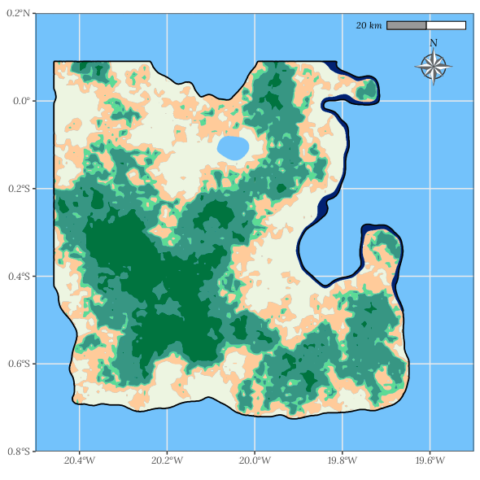

```{r setup, include=FALSE}
library(learnr)
knitr::opts_chunk$set(echo = FALSE)
```

# Welcome

<txt-green>Welcome to the first lesson</txt-green> of the **National Forest Inventory eLearning practice module**.



This interactive module is designed to complement the [NFI eLearning modules](https://bit.ly/3m5VEsE) with practical hands-on exercises. These exercises take place on a fictional island that just emerged in the middle of the Atlantic Ocean: `Louland`. 

It features interactive lessons designed to practice National Forest Inventory (NFI) sampling and the exploratory analysis of NFI field data with the [R programming language](www.r-project.com). Although this fictional land is not an official country, we will use the acronym NFI when referring to its forest inventory as the method and formulas applied here are valid for nationwide forest inventories.


<br>

---

<br>

## Topic 1

### Exercise 

*Here's a simple exercise with an empty code chunk provided for entering the answer.*

Write the R code required to add two plus two:

```{r two-plus-two, exercise=TRUE}
1+1
```

### Exercise with Code

*Here's an exercise with some prepopulated code as well as `exercise.lines = 5` to provide a bit more initial room to work.*

Now write a function that adds any two numbers and then call it:

```{r add-function, exercise=TRUE, exercise.lines = 5}
add <- function() {
  
}
```

## Topic 2

### Exercise with Hint

*Here's an exercise where the chunk is pre-evaulated via the `exercise.eval` option (so the user can see the default output we'd like them to customize). We also add a "hint" to the correct solution via the chunk immediate below labeled `print-limit-hint`.*

Modify the following code to limit the number of rows printed to 5:

```{r print-limit, exercise=TRUE, exercise.eval=TRUE}
mtcars
```

```{r print-limit-hint}
head(mtcars)
```

### Quiz

*You can include any number of single or multiple choice questions as a quiz. Use the `question` function to define a question and the `quiz` function for grouping multiple questions together.*

Some questions to verify that you understand the purposes of various base and recommended R packages:

```{r quiz}
quiz(
  question("Which package contains functions for installing other R packages?",
    answer("base"),
    answer("tools"),
    answer("utils", correct = TRUE),
    answer("codetools")
  ),
  question("Which of the R packages listed below are used to create plots?",
    answer("lattice", correct = TRUE),
    answer("tools"),
    answer("stats"),
    answer("grid", correct = TRUE)
  )
)
```
