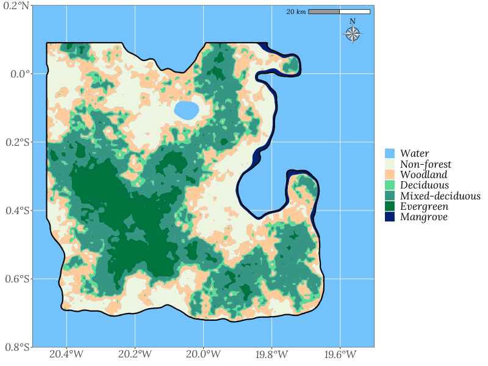

```{r setup, include=FALSE}

## Options
knitr::opts_chunk$set(echo=F, message=F, warning=F)

## --- Spatial
library(sf)
library(units)
library(tmap)

## --- Data
library(eNFI)

## --- Data analysis
library(tidyverse)

## --- Style
library(ggspatial)
library(sysfonts)
library(showtext)

sysfonts::font_add("Lora", system.file("fonts/lora-v23-latin-italic.ttf", package = "eNFI", mustWork = T))
sysfonts::font_add("Shadow", system.file("fonts/shadows-into-light-v14-latin-regular.ttf", package = "eNFI", mustWork = T))
showtext::showtext_auto()


## Load data
load(system.file("extdata/louland_param.Rda", package = "eNFI"))
load(system.file("extdata/louland_lc.Rda", package = "eNFI"))
load(system.file("extdata/louland_admin.Rda", package = "eNFI"))
load(system.file("extdata/sf_exfi.Rda", package = "eNFI"))

## Load solutions
load(system.file("extdata/solutions-lesson1.Rda", package = "eNFI"))

## fixed profile - more profiles to be implemented in V2.0
## Rename tables
newland_name <- "Louland"

sf_lc    <- louland_lc
sf_admin <- louland_admin
pal      <- louland_param$hex
nb_ft <- 4

## Tutorial setup - Comment out to print docx for review
library(learnr)
library(gradethis)

tutorial_options(
  exercise.timelimit = 40,
  exercise.reveal_solution = FALSE
  )

gradethis_setup()


## For printing docx
# knitr::opts_chunk$set(error=TRUE)
# 
# grade_this_code <- function(x){return("")}
# grade_code      <- function(x){return("")}

```


## Welcome!

<txt-green>Welcome</txt-green> to the first lesson of the **National Forest Inventory eLearning practice module**.

```{r}

## Check pandoc output format 

# if (knitr::opts_knit$get('rmarkdown.pandoc.to') != "docx") {
#   
#   print(knitr::opts_knit$get('rmarkdown.pandoc.to'))
# 
#   
# } else {
#   
#   print("else \n")
#   print(knitr::opts_knit$get('rmarkdown.pandoc.to'))
#   
# }

```

###


This interactive module is designed to complement the [NFI eLearning modules](https://bit.ly/3m5VEsE) with practical hands-on exercises. These exercises take place on a fictional island that just emerged in the middle of the Atlantic Ocean: `Louland`. 

It features interactive lessons designed to practice National Forest Inventory (NFI) sampling and the exploratory analysis of NFI field data with the [R programming language](www.r-project.com). Although this fictional land is not an official country, we will use the acronym NFI when referring to its forest inventory as the method and formulas applied here are valid for nationwide forest inventories.


### Objectives

In this first lesson, **Overview of the preliminary data**, we will discover the land cover of `Louland`, and we will recalculate the average Aboveground Biomass (AGB) of a small inventory, carried out by the first exploration crew in one forest stand. 

The objectives of this lesson are:

- familiarize yourself with how the interactive lessons of the NFI technical module 9 work,
- familiarize yourself with `Louland`, our fictional land to practice national Forest Inventory sampling design and data analysis,
- Calculate an average AGB estimate for one forest stand,
- Calculate the areas of different land covers, based on shapefile spatial data.

<br>

In this lesson, we will use the collection of packages grouped inside the package `tidyverse` for general data analysis and the package `sf` for spatial data analysis. We will also briefly use the package `units` to avoid confusion around area units.

```{r show-libs, echo=T, eval=F}

library(tidyverse)
library(sf)
library(units)

```

Note that in the background we also use `showtext` to add Google Fonts to our figures, `ggspatial` to add the North arrow and scale to our maps and `tmap` for the interactive map at the end of the lesson.

<txt-green>Let's get started!</txt-green>


### Interactions with R

Whenever you see "**Your turn!**", followed by a small console window, these are actual R consoles. You can run R code in these consoles, and you will be presented with either pre-filled code sequences, with holes for you to complete, or an empty console.

Follow the instructions and try to complete or create the code necessary to get the table, value or figure requested. The lesson continue after the exercise is completed and the correct code is submitted.


::::::{.infobox data-latex=""}

**Instructions**

The interactive lessons are designed on a trial and error model. The code is first showcased then pre-filled code with holes is presented for you to complete in order to become familiar with the commands. Finally, after a few practice exercises, the last console for a group of commands will be empty.

Let's test it out. Type `1+1` in the console below, Click **Run code** to see the results, and **Submit answer** to check if your code is correct.

```{r testr, exercise=TRUE, exercise.lines=3}


```

```{r testr-solution}
1+1
```

```{r testr-check}
grade_this_code()
```

::::::


## A new land has emerged

An island previously unknown to humankind has just been discovered and you are part of a team of scientists commissioned to inventory its forest resources, mainly its carbon stock.


::::::{.infobox data-latex=""}

In a future version of this interactive training module, you will be able to choose different land profiles with different (1) forest categories, (2) ratio of ocean covering the 90 x 90 km square frame in which the new land is created, (3) inclusion or exclusion of mangrove forests and even (4) the maximum altitude of ```r newland_name``` (it will have an impact on inaccessible plots)!

For now, ```r newland_name``` forests are divided into ```r nb_ft + 1``` categories: Evergreen forest, Mixed-Deciduous forest, Deciduous forest, Other Woodland and Mangrove Forest, also all the island is considered accessible.

::::::


The remote sensing team has developed land cover and topographic maps based on 30m resolution remote sensing images and initial forest plot measurements taken by the first exploration crew. Based on their observations, we will be able to have a general understanding of ```r newland_name```'s forest cover. This data is called **auxiliary data**, it is not NFI data *per se*, but useful information to help design and implement an NFI.

Here is what ```r newland_name```'s land covers look like with a map generated with the packages `ggplot2`, `sf` and `ggspatial`.


<!-- HTML -->


<!-- END HTML -->

In the next section, we will have a quick look at the exploration crew's forest inventory data, loaded in R as objects with the `exfi` prefix, and we will use the land cover maps to calculate the area of the main land cover types.


## First forest inventory

### Overview

First, let's have a look at the results of 10 forest plots measured by the exploration crew. The data is stored in the object `exfi_agb`. By printing the object name in the console, we will see the results:

```{r fi-demo, echo=T}

print(exfi_agb)

```


::::::{.infobox data-latex=""}

Since we are using functions from the `tidyverse` collection of R packages, data tables in these interactive lessons are `tibbles`. They are simple rectangular tables (each column has the same number of rows), and when running their names in the console, we are given the number of rows and columns, the column names with the type of data and the first 10 values for each column.

::::::


The table (or tibble) `exfi_agb` contains the number of plots `n_plot`, the mean and standard deviation for aboveground biomass and basal area: `mean_agb` and  `sd_agb` in ton/ha, `mean_ba` and `sd_ba` in m^2^/ha, and `ci` and `ci_perc` represent the confidence interval around the mean AGB in ton/ha and percentage of the mean respectively.

The 10 plots come from a random sample from one of the Evergreen forests of ```r newland_name```. The crew also shared the plot level aboveground biomass in the table name `exfi_pagb`. 

**Your turn!** Run the table name, `exfi_pagb`, in the console below to see the table's basic information.

```{r fi, exercise=TRUE, exercise.lines=3}
print(___)
```

```{r fi-solution}
print(exfi_pagb)
```

```{r fi-check}
grade_this_code()
```

The table, `exfi_pagb`, contains the ID `plot_id`, number of trees per hectare `count_tree`, basal area `plot_ba` in m^2^/ha and aboveground biomass `plot_agb` in ton/ha, for each plot.


### Recalculate the mean AGB

Given that the crew chose the plot location randomly, we can use simple aggregating functions to re-calculate the forest mean aboveground biomass and confirm their calculations. We will use a mix of base R and `tidyverse` functions, in particular the function `summarise()`. This function is very handy to aggregate numerical variables in different columns of our plot table and can even be used in combination with the `group_by()` function to summarize numerical variables based on category variables of the same table (more on that later, with the full NFI data). 

Let's see, for example, how to calculate the mean basal area of the forest with its standard deviation and save the results in a table `exfi_ba`. After creating the table, we run the table name in the console to display its content.

```{r fi-ba, echo=T}
exfi_ba <- exfi_pagb %>%
  summarise(
    mean_ba = mean(plot_ba),
    sd_ba   = sd(plot_ba)
  )
```

Which gives:

```{r fi-ba-res, echo=T}
print(exfi_ba)
```

<br>

**Your turn!** Create a table, `exfi_agb2`, with the columns `mean_agb` and `sd_agb` to create respectively the mean and standard deviation of plot level AGB, then display the results.

```{r fi-agb, exercise=TRUE, exercise.lines=6}
exfi_agb2 <- exfi_pagb %>%
  summarise(
    mean_agb = mean(___),
    sd_agb   = sd(___)
  )
```

```{r fi-agb-solution}
exfi_agb2 <- exfi_pagb %>%
  summarise(
    mean_agb = mean(plot_agb),
    sd_agb   = sd(plot_agb)
  )
```

```{r fi-agb-check}
grade_this_code("Well done!")
```


### Results 

We have successfully found the same values for AGB: ```r round(exfi_agb$mean_agb, 2)``` ton/ha, on average, with a standard deviation of ```r round(exfi_agb$sd_agb, 2)```. You can confirm by visualizing your table. Printing its name in the console below:

```{r fi-agb-res, exercise=T}
print(exfi_agb2)
```


In the next section we will have an overview of the spatial data on ```r newland_name```'s land cover classes.


## land cover types and areas

### Spatial objects

We can use the land cover shapefile provided to us, by the remote sensing analysts, to view the extent of the different land covers and calculate the area of the forest cover. The shapefile is loaded in the R environment under the name `sf_lc` with the package `sf`. It contains the attribute table, the geometries and the coordinate reference system of ```r newland_name```'s land cover. Running the object by its name in the console displays its summary information.

```{r sf_newland, echo=T}
print(sf_lc)
```

This summary view regroups the Coordinate Reference System (CRS), the type of geometry (polygon), the number of polygons (features) and fields, and the detailed information on the first 10 polygons in the shapefile. The four fields represent the polygon IDs (`id`), the land cover IDs (`lc_id`), codes (`lc`) and names (`lc_name`).

To isolate the list of different land covers we first need to convert the spatial data into a tibble with the function `as_tibble()`, then select only the columns related to land cover information with the function `select()`. We can use the `distinct()` function to keep only unique values across the newly formed data table. Finally, since the land cover IDs are numerical, we can sort the resulting table by increasing value of `lc_id` with the function `arrange()`.

```{r lc-info, echo=T}
lc_tab <- sf_lc %>%
  as_tibble() %>%
  select(lc_id, lc, lc_name) %>%
  distinct() %>%
  arrange(lc_id)

print(lc_tab)
```


::::::{.infobox data-latex=""}

With the `tidyverse` packages, we have the pipe operator, `%>%`. This operator allows us to apply functions one after the other, in a sequence and without needing to save each intermediate step in a new object.

Step-by-step the above code could be written as:

```{r, eval=F, echo=T}

t1 <- as_tibble(sf_lc)
t2 <- select(.data = t1, lc_id, lc, lc_name)
t3 <- distinct(.data = t2)
lc_tab <- arrange(.data = t3, lc_id)

```

Notice that with the pipe operator, `%>%`, we can place the commands one after the other and the resulting table of each function is silently passed to the next function. We don't need to repeat the input `.data = `.

:::::::


::::::{.infobox data-latex=""}

**Let's set a few naming conventions.**

All forest inventory-related tables are stored in R objects with names related to their contents. For example the NFI plot and tree data are stored in tables `plot` and `tree`, respectively. 

Using `plot` as a table name is not very good practice in R, as `plot()` is the base R function for plotting data. However, we still keep it because it is an informative name. The NFI tables in this tutorial are: `plot`, `tree` and `species_list`. 

The prefix `exfi_`, from the tables shown in the previous section was added for the data from the first exploration crew's forest inventory.

Similarly, all spatial data are handled mostly with the `sf` package, and the prefix, `sf_`, was used as a naming convention. The spatial objects available for this tutorial are as follows: `sf_admin`, `sf_lc` and `sf_topo`, respectively the administrative boundaries, land cover, and topography of ```r newland_name```.

::::::


### Land cover areas

`sf` objects behave similarly to standard tibbles, making it easy to apply `tidyverse` functions, while keeping the spatial information, or to convert them to tibbles with the function `as_tibble()`. The `sf` package also contains the `st_area()` function that we are going to use to calculate the areas of the land covers.

In the following sequence, we combine the function `mutate()`, used to create or modify columns in our target table, with the function `st_area()`. Since `st_area()` takes the whole spatial object as input, we could use `st_area(sf_lc)` or `st_area(.)`, which is the standard way to call the current state of a tibble inside a sequence of functions linked with pipes.

```{r get-area, echo=T}
area_lc <- sf_lc %>%
  mutate(
    area_m2 = st_area(.),
    area_ha = units::set_units(area_m2, value = ha)
    ) %>%
  as_tibble() %>% 
  group_by(lc) %>%
  summarise(area_ha = sum(area_ha))
```

Which gives:

```{r get-area-res, echo=T}
print(area_lc)
```


**Your turn!** Calculate the total area of land in ```r newland_name```, all land cover classes together, and save it in an object `area_tot`.

Hint: `group_by()` is not necessary anymore.


```{r lc-area, exercise=TRUE, exercise.lines=8}
area_tot <- sf_lc %>%
  mutate(
    area_m2 = st_area(___),
    area_ha = units::set_units(___, value = ha)
    ) %>%
  as_tibble() %>% 
  summarise(___ = sum(___))
```

```{r lc-area-solution}
area_tot <- sf_lc %>%
  mutate(
    area_m2 = st_area(.),
    area_ha = units::set_units(area_m2, value = ha)
    ) %>%
  as_tibble() %>% 
  summarise(area_ha = sum(area_ha))
```

```{r lc-area-check}
grade_code("Amazing!")
```


### Results

Check the total area:

```{r lc-area-res, exercise=T}
print(area_tot)
```

We have found that the total area of ```r newland_name``` is ```r round(area_tot$area_ha)``` ha. From the table `area_lc`, we know that ```r round(area_lc %>% filter(lc == "WA") %>% pull(area_ha))``` and ```r round(area_lc %>% filter(lc == "NF") %>% pull(area_ha))``` ha are Water and Non-forest respectively. This leaves ```r round(area_lc %>% filter(!(lc %in% c("WA", "NF"))) %>% pull(area_ha) %>% sum())``` ha of Forest land.


## Conclusion

This is the end of the lesson 1. In the next lessons, we will use these preliminary data to design different sampling frames and analyze tree and plot data. Forest inventory data will be assigned to our sampling design and we will use it to estimate several NFI main variables, such as carbon, biodiversity or production indicators.

Before moving on with the <txt-green>sampling designs</txt-green> and other lessons in this practice module, here is a dynamic view of ```r newland_name``` and the first 10 forest inventory plots, using the package `tmap`.

```{r tmap1}

sf_exfi2 <- sf_exfi %>%
  left_join(exfi_pagb, by = "plot_id")

tmap_options(check.and.fix = TRUE)
tmap_mode("view")
tm_basemap(server = "Esri.WorldTopoMap") +
tm_shape(sf_lc) + tm_polygons(col = "lc", 
                              title = "Land cover",
                              palette = pal, 
                              popup.vars = c("lc", "id"), border.alpha = 0) +
tm_shape(sf_exfi2) + tm_dots(col = "plot_agb", title = "AGB (t/ha)", size = 0.1)

```


<!-- End of lesson 1 intro to Newland -->


