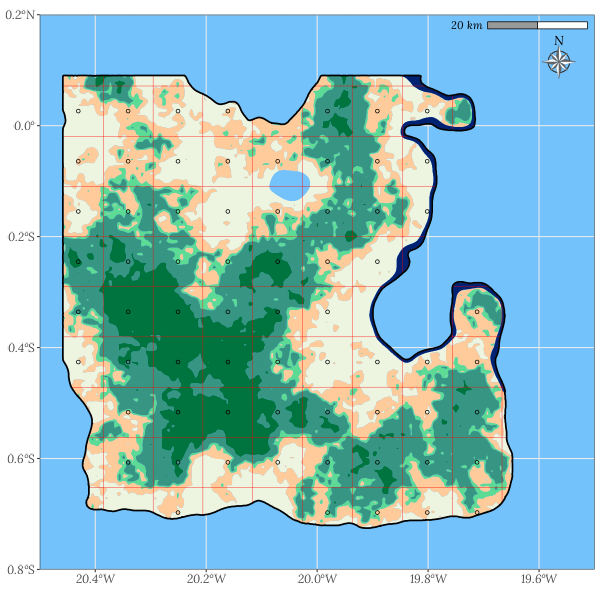
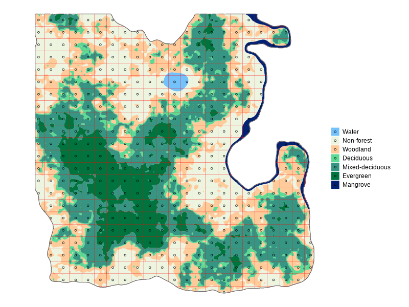
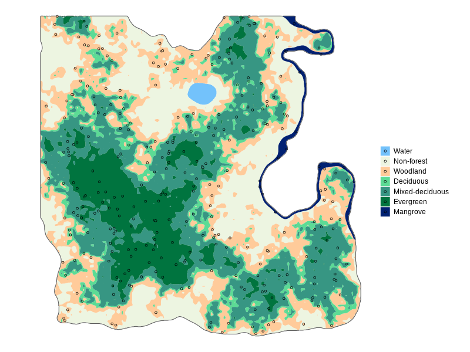

```{r setup, include=FALSE}

## Options
options(yaml.eval.expr = T)

knitr::opts_chunk$set(echo=F, message=F, warning=F)

## --- Spatial
library(sf)
library(units)
library(tmap)

## --- Data
library(eNFI)

## --- Data analysis
library(tidyverse)

## --- Style
library(ggspatial)
library(sysfonts)
library(showtext)

sysfonts::font_add("Lora", system.file("fonts/lora-v23-latin-italic.ttf", package = "eNFI", mustWork = T))
sysfonts::font_add("Shadow", system.file("fonts/shadows-into-light-v14-latin-regular.ttf", package = "eNFI", mustWork = T))
showtext::showtext_auto()


## Load data
load(system.file("extdata/louland_param.Rda", package = "eNFI"))
load(system.file("extdata/louland_lc.Rda", package = "eNFI"))
load(system.file("extdata/louland_admin.Rda", package = "eNFI"))
load(system.file("extdata/sf_exfi.Rda", package = "eNFI"))

## Load solutions
load(system.file("extdata/solutions-lesson21-part1.Rda", package = "eNFI"))
load(system.file("extdata/solutions-lesson21-part2.Rda", package = "eNFI"))
load(system.file("extdata/solutions-lesson21-part3.Rda", package = "eNFI"))

## fixed profile - more profiles to be implemented in V2.0
## Rename tables
newland_name <- "Louland"

sf_lc    <- louland_lc
sf_admin <- louland_admin
pal      <- louland_param$hex
nb_ft <- 4

## Tutorial setup - Comment out to print docx for review
library(learnr)
library(gradethis)

tutorial_options(
  exercise.timelimit = 40#,
  #exercise.reveal_solution = FALSE
  )

gradethis_setup()


## For printing docx
# knitr::opts_chunk$set(error=TRUE)
# 
# grade_this_code <- function(x){return("")}
# grade_code      <- function(x){return("")}

```


<!-- Section 1 -->

## Welcome back!

<txt-green>This is the second lesson</txt-green> of the National Forest Inventory eLearning practice module.


###



This interactive module is designed to complement the National Forest Inventory eLearning Modules with practical, hands-on exercises. As you learned in lesson one, these exercises take place on a fictional island that just emerged in the middle of the Atlantic Ocean: `Louland`.

The practice module features interactive lessons designed to practice National Forest Inventory (NFI) sampling and the exploratory analysis of NFI field data with the [R programming language](www.r-project.com). Although this fictional land is not an official country, we will use the acronym NFI when referring to its forest inventory as the method and formulas applied here are valid for nationwide forest inventories.

Lesson 2 focuses on several sampling methods that we call "simple sampling" as they are based on the <txt-green>simple random sampling statistics</txt-green>. 


### Objectives 

As we have seen in the NFI eLearning Modules, NFIs are multi-purpose in nature, but the sampling design requires that we focus on one main variable of interest. In this lesson, <txt-green>the main variable of interest is the forest mean aboveground biomass</txt-green> of `r newland_name`. 

Here, we will limit ourselves to random and systematic sampling, and we will obtain aboveground biomass estimates for each forest type through post-stratification.


::::::{.infobox data-latex=""}

If you have not completed lesson 1: *Overview of the preliminary data*, we encourage you to start there. Lesson 1 provides a small overview of `r newland_name` and introduces how you will interact with the R consoles that are embedded in this document.

::::::


Lesson 2 is divided into two parts:

1. Sampling design
1. Data analysis

We will now bagin part 1. We will develop a <txt-green>sampling design</txt-green> for estimating the mean carbon stock of `r newland_name`'s forests in ton/ha. The objectives of part 1 are:

- Estimate sample size based on a precision/cost trade-off (cost being simplified to the number of plots that we can afford for now),
- Find a sampling grid size for a systematic sampling, closest to the estimated number of samples. 
- Create a simple random sampling with the same number of plots.
- Compare the distribution of plots per forest category for these two types of simple sampling designs.


::::::{.infobox data-latex=""}

Please note that nowadays many countries do not use these sampling design methods due to several inconveniences. These designs are often not optimal, as different sub-populations have different variability, and taking variability into consideration allows for more optimal designs (See module 3 on Sampling for more information).

However, since the calculations for the estimations resulting from these sampling methods are fairly simple, they constitute a good entry point to sampling and we will start from there. More advanced sampling design methods for NFI, *i.e.* stratified and ratio estimators, are the focus of other interactive lessons.

::::::


### Setup

In this lesson, we will use the collection of packages grouped inside the package `tidyverse` for general data analysis and the package `sf` for spatial data analysis. We will also briefly use the package `units` to avoid confusion around area units.

```{r libs, eval=F}

library(tidyverse)
library(sf)
library(units)

```

Note that in the background we also use `extrafont` to add Google Fonts to our figures and `ggspatial` to add the North arrow and scale to our maps.

<txt-green>Let's get started!</txt-green>


<!-- Section 2 -->

## Sampling size

Remember in the third NFI eLearning Module, the formula to estimate the **sampling size**, `n`, based on Simple Random Sample (SRS), is:

$$n = \left(\frac{CV \cdot t^{1 - \alpha/2}_{n-1}}{A}\right)^2 \sim \left(\frac{CV \cdot 1.96}{A}\right)^2$$
with:

- $CV = s / \overline{y} \times 100$ the NFI main variable coefficient of variation expressed as percentage, 
- $s$ and $\overline{y}$ the samples main variable's standard deviation and average respectively,
- $A$ the desired precision in percentage, and 
- $t^{1 - \alpha/2}_{n-1}$ the Student's t-value with $n-1$ degrees of freedom and $1-\frac{\alpha}{2}$ confidence level where $\alpha$ is the significance level. This value is approximated by the value 1.96 when assuming an infinite sample and 0.95 confidence level (two tails $\alpha$ = 0.05).


###

Thanks to the results of the preliminary forest inventory (`exfi_agb`), we have an estimate of $\overline{y}$ and $s$ for a forest stand in ```r newland_name```. While this stand is most likely not representative of the whole island, we can use it to make an estimate of the number of samples necessary to achieve various target precision values. The final number of plots will depend on the desired precision and your budget constraints. In case of systematic sampling we can add an additional constraint: we want the NFI grid size in km to be an integer number (i.e. 1, 2, 3. etc.).


###

We looked at the table `exfi_agb` in Lesson 1, let's show it again to remind ourselves the inventory's mean aboveground biomass, `mean_agb`, and it's standard deviation, `sd_agb`. Print the table name in the console below.

```{r exfi, exercise=TRUE, exercise.lines=3}


```

```{r exfi-solution}
print(exfi_agb)
```

```{r exfi-check}
grade_this_code()
```


###

The table contains aggregated information on the number of trees measured, the average basal area (BA), in m^2^/ha, and aboveground biomass (AGB) in ton/ha. The aboveground biomass is associated with its confidence interval in ton/ha and in percentage.


```{r question1}

question("What is the average aboveground biomass in ton/ha in the preliminary forest inventory?",
  answer(as.character(round(exfi_agb$mean_agb,0)), correct = TRUE),
  answer("303"),
  answer("115"),
  answer("53"),
  incorrect = "Incorrect, the average aboveground biomass is in the column mean_agb.",
  allow_retry = TRUE
)

``` 

Back to calculating a sampling size, let's first calculate the number of samples for different precision levels. For a 5% precision, the number of samples is:

```{r n05, echo=T, eval=F}

n05 <- round(((exfi_agb$sd_agb / exfi_agb$mean_agb * 100) * 1.96 / 5)^2)

```

Which gives:

```{r, echo=T}

print(n05)

``` 


###

**Your turn, calculate `n10`, `n15` and `n20`, the number of samples necessary to get respectively 10%, 15% and 20% precision on ```r newland_name```'s mean aboveground biomass.**

**Start with the Calculations for 10% here**: 

```{r n10, exercise=TRUE, exercise.lines=6}

n10 <- round(((exfi_agb$sd_agb / exfi_agb$mean_agb * 100) * ___ / ___)^2)


```

```{r n10-solution}

n10 <- round(((exfi_agb$sd_agb / exfi_agb$mean_agb * 100) * 1.96 / 10)^2)

```

```{r n10-check}

grade_this_code(print(n10))

```


###

**Continue with calculations for 15% here**: 


```{r n15, exercise=TRUE, exercise.lines=6}

n15 <- round(((exfi_agb$sd_agb / exfi_agb$mean_agb * 100) * ___ / ___)^2)


```

```{r n15-solution}

n15 <- round(((exfi_agb$sd_agb / exfi_agb$mean_agb * 100) * 1.96 / 15)^2)

```

```{r n15-check}

grade_this_code(print(n15))

```

 
  
###

**And calculations for 20% here**: 


```{r n20, exercise=TRUE, exercise.lines=6}

n20 <- round(((exfi_agb$sd_agb / exfi_agb$mean_agb * 100) * ___ / ___)^2)


```

```{r n20-solution}

n20 <- round(((exfi_agb$sd_agb / exfi_agb$mean_agb * 100) * 1.96 / 20)^2)

```

```{r n20-check}

grade_this_code(print(n20))

```


###

Well done! **We have enough to budget for approximately 300 plots**. 

```{r question2, echo=F}

question("What precision can we afford?",
  answer("5%"),
  answer("10%", correct = TRUE),
  answer("15%"),
  answer("20%"),
  incorrect = "Incorrect, look again at the numnber of plots given for different precision targets.",
  allow_retry = TRUE
)

``` 


<!-- Section 3 -->

## Systematic sampling

Now let's see what sampling grid spacing is the closest to a sampling size of `r n10` plots, the number of plots selected with our budget constraint. We will start with <txt-green>systematic sampling</txt-green> to account for the additional constraint on grid spacing, and afterwards we will make a simple random sampling that matches the same number of plots.


### Grid spacing

To calculate the grid spacing that corresponds to our sampling size, we must first divide forest area by sampling size to obtain an estimate of the area that each sample point represents. For a square grid, the square root of this division gives the grid spacing. For example, for a 1,000 ha forest and a sampling size of 20 plots, the grid size will be:

$$d = \sqrt{\frac{1000 ha}{20}} = \sqrt{50ha} = \sqrt{500000m^2} \approx 707.1m$$

In our case, we can calculate the forest area of `r newland_name` from the table, `area_lc`, calculated in Lesson 1. We need to (1) filter forested land cover classes with the function `filter()`, (2) extract their area with the function `pull()` and (3) sum their area. 


###

**Your turn! Use the console below to create the object, `area_forest`, which contains the total forest area.**

Remember that our land cover classes are coded `EV`, `MD`, `DD`, `MG`, `WL`, `NF` and `WA` for Evergreen, Mixed Deciduous, Deciduous and Mangrove Forests, Woodland, Non-Forest and Water respectively.

```{r areafor, exercise=TRUE, exercise.lines=6}


```

```{r areafor-hint-1}

## First run `area_lc` in the console to see what land cover classes are
## represented and which codes need to be filtered

```

```{r areafor-hint-2}

area_forest <- area_lc %>%
  filter(lc %in% c(___)) %>%
  pull(___) %>%
  sum()

```

```{r areafor-solution}

area_forest <- area_lc %>%
  filter(lc %in% c("EV", "MD", "DD", "MG", "WL")) %>%
  pull(area_ha) %>%
  sum()

```

```{r areafor-check}

gradethis::grade_code(print(area_forest))

```


###

Then we need to convert the forest area from hectares to square km:

```{r, echo=T}

area_forest_km2 <- as.numeric(set_units(area_forest, value = km2))

print(area_forest_km2)

``` 


###

Finally, we can apply the grid spacing formula with the square root function `sqrt()`, and the sampling size for a 10% precision, `n10`. Complete the following code sequence to calculate the grid spacing.


```{r gridspacing, exercise=TRUE, exercise.lines=6}

grid_spacing <- round(sqrt(___ / ___), 3)

```

```{r gridspacing-solution}

grid_spacing <- round(sqrt(area_forest_km2 / n10), 3)

```

```{r gridspacing-check}

gradethis::grade_this_code()

```


### 

The grid spacing is:
 
```{r, echo=T}

print(grid_spacing)

```

It is slightly larger than 4km. We must note here that the number of plots falling on forest land might differ from this hypothetical value, depending on the forest distribution. We need to create the grid and calculate how many plots are located on forest land in order to cross check that the grid spacing fits our desired cost/precision sampling size. Even after this confirmation, there can be mapping errors and several plots confirmed to be located on forest land that may not be actually forested. 


::::::{.infobox data-latex=""}

To help you become familiar with the R code, we will demonstrate the sequence of commands to create the grid, map it and calculate the number of plots per land cover class on a 5 x 5 km grid and we will let you develop the 4 x 4 km grid through guided exercises.

::::::


### Create grid points

The `sf` package contains the function `st_make_grid()` to create grids, and aligned or unaligned grid points within grid polygons. We have the `sf_admin` shapefile that contains the administrative boundary of `r newland_name` and can be used as a canvas for the grid. 

We have two `sf` objects in the preliminary data: `sf_admin`, the administrative boundaries of  `r newland_name` and `sf_lc` the land cover shapefile data of `r newland_name`. In the console below you can run the object names to see their basic information.

```{r check-sf, exercise=TRUE, exercise.lines=3}


```


###

:::::::{.infobox data-latex=""}

By default, the grid starting point is the land most Southern and Western point. Systematic sampling designs are considered to be random samples of size one as only the starting point of their grid is chosen randomly. To get a random starting point so, we will chose randomly an integer value between 500 meters and 2 km. We start at 500m to avoid having too many plots at the edge of the land. This is a precaution specific for this exercise, as ```r newland_name```'s shape is close to a square. This precaution may not be needed in a real country! The `offset` is calculated based on the land cover shapefile bounding box calculated with `st_bbox()`.

```{r offset, echo=T, eval=F}

set.seed(10)
random_x <- sample(500:2000, size = 1)
random_y <- sample(500:2000, size = 1)
offset <- st_bbox(sf_lc)[c("xmin", "ymin")] + c(-random_x, -random_y)

```

:::::::


### How to create grids

To create a 5 x 5 km grid, we will fill the input `cellsize` with `c(5000, 5000)` as the unit is meters, and to make the grid we use the option `what = "polygon"`:

```{r grid5, echo=T, eval=F}

sf_grid5 <- st_make_grid(sf_lc, cellsize = c(5000, 5000), what = "polygons", offset = offset) %>%
  st_intersection(sf_admin) %>%
  st_as_sf()

```


###

**Your turn! Adapt the above code to create `sf_grid4`,  the 4 x 4 km grid.** 

```{r grid4, exercise=TRUE, exercise.lines=6}

sf_grid4 <- st_make_grid(sf_lc, cellsize = c(___, ___), what = ___, offset = ___) %>%
  st_intersection(sf_admin) %>%
  st_as_sf()

```

```{r grid4-solution}

sf_grid4 <- st_make_grid(sf_lc, cellsize = c(4000, 4000), what = "polygons", offset = offset) %>%
  st_intersection(sf_admin) %>%
  st_as_sf()

```


```{r grid4-check}

gradethis::grade_this_code()

```


### How to create aligned sampling points {-}


To create the points, we change the option to `what = "center"` (replace `"center"` with `"corner"` to locate the points at the grid intersections). At this stage, we can also use the function `st_intersection()` to reduce the grid to our 'country' boundaries and the function `st_as_sf()` converts the result of the intersection to an `sf` object. 

```{r points5, echo=T, eval=T}

sf_points5 <- st_make_grid(sf_lc, cellsize = c(5000, 5000), what = "centers", offset = offset) %>%
  st_intersection(sf_admin) %>%
  st_as_sf()

```


###

**Your turn! Prepare `sf_point4`, the points' location on the 4 x 4 k grid.**

```{r points4, exercise=TRUE, exercise.lines=6}


```

```{r points4-hint}

sf_points4 <- st_make_grid(sf_lc, cellsize = c(___, ___), what = ___, offset = ___) %>%
  st_intersection(___) %>%
  st_as_sf()

```

```{r points4-solution}

sf_points4 <- st_make_grid(sf_lc, cellsize = c(4000, 4000), what = "centers", offset = offset) %>%
  st_intersection(sf_admin) %>%
  st_as_sf()

```

```{r points4-check}

gradethis::grade_this_code()

```


###

We can finally overlap the grid points with the land cover layer, using the function `st_join()`, to assign land cover to each plot. We aim for our land cover code `lc` to appear in a certain order in the map. To follow the order of the land cover numerical ID `lc_id`, we use the function `fct_reorder()` from the tidyverse package `forcats`. This function converts a text variable into an ordered factor following an other variable (in our case `lc_id`). 

```{r plot5, echo=T, eval=F}

sf_plot5 <- sf_points5 %>%
  st_join(sf_lc) %>%
  mutate(lc = fct_reorder(lc, lc_id)) %>%
  filter(!is.na(lc))

```


###

**Your turn! Adapt the above code to prepare `sf_plot4`, joining the points location and the land cover class spatial data.**

```{r plot4, exercise=TRUE, exercise.lines=6}


```

```{r plot4-hint}

sf_plot4 <- ___ %>%
  st_join(___) %>%
  mutate(lc = fct_reorder(___, ___)) %>%
  filter(___)

```

```{r plot4-solution}

sf_plot4 <- sf_points4 %>%
  st_join(sf_lc) %>%
  mutate(lc = fct_reorder(lc, lc_id)) %>%
  filter(!is.na(lc))

```

```{r plot4-check}

gradethis::grade_this_code()

```


### Visualize

We can visualize the grid with the following code based on the `ggplot2` package and its `geom_sf()` function to display `sf` objects. 


:::::::{.infobox data-latex=""}

We have a custom color palette `pal` for ```r newland_name``` land covers. We can see this color palette with the function `show_col()`, from the `scales` package

```{r pal, out.width='50%'}
pal <- c("#73c2fb", "#edf5e1", "#ffcb9a", "#5cdb95", "#379683", "#00743f", "#012172")

library(scales)
show_col(pal)
```

::::::


###

Here is the code to make the map with the 5 x 5 km systematic sampling design.

```{r gr-grid5, echo=T, eval=F}

ggplot() +
  geom_sf(data = sf_lc, aes(fill = lc), color = NA) +
  geom_sf(data = sf_plot5, aes(fill = lc), shape = 21) +
  geom_sf(data = sf_grid5, fill = NA, col = "red", size = 0.1) +
  geom_sf(data = sf_admin, fill= NA) +
  scale_fill_manual(values = pal) +
  labs(fill = "", color = "") +
  theme_void()

```

<!-- HTML -->

<!-- END HTML -->


###

**Your turn! Try to adapt this code to make the same map with the 4 x 4 km grid.**

```{r gr-grid4, exercise=TRUE, exercise.lines=10}

```

```{r gr-grid4-hint}

ggplot() +
  geom_sf(data = ___, aes(fill = lc), color = NA) +
  geom_sf(data = ___, aes(fill = lc), shape = 21) +
  geom_sf(data = ___, fill = NA, col = "red", size = 0.1) +
  geom_sf(data = ___, fill= NA) +
  scale_fill_manual(values = ___) +
  labs(fill = "", color = "") +
  theme_void()

```

```{r gr-grid4-solution}

ggplot() +
  geom_sf(data = sf_lc, aes(fill = lc), color = NA) +
  geom_sf(data = sf_plot4, aes(fill = lc), shape = 21) +
  geom_sf(data = sf_grid4, fill = NA, col = "red", size = 0.1) +
  geom_sf(data = sf_admin, fill= NA) +
  scale_fill_manual(values = pal) +
  labs(fill = "", color = "") +
  theme_void()

```

```{r gr-grid4-check}

gradethis::grade_this_code()

```


###

Well done here is what the 4 x 4 km grid look like:

<!-- HTML -->

<!-- END HTML -->


### Calculate the number of plots per land cover class

To calculate the number of plots in each land cover class, we need to group the plots by land cover with the function `group_by()`, then count them with the function `summarise()` (remember lesson 1) and the function `n()`. The function `n()` counts the number of rows in a table or in each category of a category variable. As we don't need the spatial information, we first convert our `sf` object to a tibble with the function `as_tibble()`. For the 5 x 5 km grid the number of plots peer land cover category is calculated with:

```{r nplot5, echo=T, eval=F}

nplot5 <- sf_plot5 %>%
  as_tibble() %>%
  group_by(lc) %>%
  summarise(n = n())
 

```

Which gives:

```{r, echo=T}

print(nplot5)

```


###

**Your turn! Calculate the number of plots per land cover class with the 4 x 4 km grid**

```{r nplot4, exercise=TRUE, exercise.lines=6}


```

```{r nplot4-hint}

nplot4 <- ___ %>%
  as_tibble() %>%
  ___(lc) %>%
  ___(n = n())


```

```{r nplot4-solution}

nplot4 <- sf_plot4 %>%
  as_tibble() %>%
  group_by(lc) %>%
  summarise(n = n())

```

```{r nplot4-check}

gradethis::grade_this_code(print(nplot4))

```


###

Last step, to get the total number of forest plots, we need to filter out non-forest categories with the function `filter()` and sum up the remaining number of plots.

```{r nplot5tot, echo=T, eval=F}

nplot5_total <- nplot5 %>%
  filter(!(lc %in% c("WA", "NF"))) %>%
  summarise(n = sum(n))

```

Which gives:

```{r, echo=T}

print(nplot5_total)

```


###  

**Your turn! Calculate the total number of forest plots in the 4 x 4 km grid.**

```{r nplot4tot, exercise=TRUE, exercise.lines=6}


```

```{r nplot4tot-hint}

nplot4_total <- ___ %>%
  filter(!(lc %in% c("WA", "NF"))) %>%
  summarise(___)

```

```{r nplot4tot-solution}

nplot4_total <- nplot4 %>%
  filter(!(lc %in% c("WA", "NF"))) %>%
  summarise(n = sum(n))

```


```{nplot4tot-check}

gradethis::grade_this_code()

```
  


###

Good job! Looking back at the sampling size given by different precision levels, we had ```r round(n10)``` plots for 10% precision and ```r round(n15)``` plots for 15% precision. Our budget is enough to measure around 300 plots, so we can afford an expected precision of 10%. <txt-green>The 4 x 4 km grid</txt-green> anticipates `r nplot4_total$n` plots in forest land and its exactly what we need and can afford.


### Systematic sampling: Recap

Based on the preliminary inventory, and analyzing using R skills, we have now identified a good sampling grid. To recap, the process was:

1. We used the **preliminary forest inventory** results to calculate a hypothetical number of samples required for a desired precision of 5, 10, 15 or 20%.
1. Based on our available budget we have identified what precision we can afford and how many plots it requires, *i.e.* our **sampling size**.
1. We have then created different **sampling grids** for `r newland_name` and estimated how many plots would fall on forest land.
1. We have selected the most adequate sampling grid based on our **cost/precision trade-off**.


<!-- Section 4 -->

## Random Sampling

Simple random sampling (SRS) designs have a number of disadvantages and are generally not recommended at a national scale. We will still relocate our ```r nplot4_total$n``` plots randomly to compare with our systematic sampling design. 


### Demo

The equivalent of the function `st_make_grid()` for random sampling is `st_sample()`. Every time the function `st_sample()` is used a new set of random locations is created. To get the same random allocation every time we run the code, we need to set a "seed" using the function `set.seed()`. In the following example, we will use `set.seed(10)` but feel free to change or remove at will the chose seed number in the practice below.


::::::{.infobox data-latex=""}

As the plot locations are completely random, we have no control over how many plots are going to land on forest versus non-forest land. We can apply two possible strategies to reach our target number of plots inside forest land:

1. Filter out non-forest polygons and make the sample size equal to the total number of plots in forest land from our 4 x 4 km sampling grid `nplot4_total$n`.
1. Make the sampling size equal to the original number of points in a 4 x 4 km grid `nrow(sf_points4)`, and accept that the final number of plots may be slightly different from the previous systematic sampling. 

We can anticipate that the second solution is better if you are also interested in non-forest land, although there is no guarantee you will have enough plots in each land cover type. Here, we will favor option 1, as our primary target is forest carbon stock.

As `sf` objects behave similarly to tibbles, the tidyverse function, `filter()`, will allow us to prepare a forest only shapefile. To do so, we we filter only the forest types from the original land cover `sf` object.

```{r forest, echo=T, eval=F}

sf_forest <- sf_lc %>%
  filter(lc %in% c("EV", "MD", "DD", "WL", "MG"))

```

::::::


We can now create the random points based on the `sf_forest` canvas.

```{r srs, echo=T, eval=F}

set.seed(10)
sf_points_rd <- st_sample(x = sf_forest, size = nplot4_total$n) %>%
  st_as_sf()

```


We can then extract the land cover at the plots' location:

```{r srs-plot, echo=T, eval=F}

sf_plot_rd <- sf_points_rd %>%
  st_join(sf_lc) %>%
  mutate(
    lc = fct_reorder(lc, lc_id),
    lc_name = fct_reorder(lc_name, lc_id)) %>%
  filter(!is.na(lc))

```

And map them:

```{r srs-map, , echo=T, eval=F}

ggplot() +
  geom_sf(data = sf_lc, aes(fill = lc_name), color = NA) +
  geom_sf(data = sf_plot_rd, aes(fill = lc_name), shape = 21) +
  geom_sf(data = sf_admin, fill = NA) +
  scale_fill_manual(values = pal) +
  labs(fill = "", color = "") +
  theme_void()

```

<!-- HTML -->

<!-- END HTML -->

 
### 

Now let's calculate the number of plots per land cover category to see if our random sampling is comparable to our systematic sampling.

```{r srs_nplot, echo=T, eval=F}

nplot_rd <- sf_plot_rd %>%
  as_tibble() %>%
  group_by(lc) %>%
  summarise(n = n())

```

It gives the following plot distribution

```{r, echo=T}

print(nplot_rd)

```


### Practice

**Your turn! In the console below, test a different seed number: 100, and visualize the results.**

- Create the points simple feature `sf_points_rd2` with seed 100 and identical simple feature and number of forest plots as the demo:

```{r srs2, exercise=TRUE, exercise.lines=6}

set.seed(100)
sf_points_rd2 <- st_sample(x = ___, size = ___) %>%
  st_as_sf()

```

```{r srs2-solution}

set.seed(100)
sf_points_rd2 <- st_sample(x = sf_forest, size = nplot4_total$n) %>%
  st_as_sf()

```


```{r srs2-check}

gradethis::grade_this_code()  

```


###

- Add the land cover information to `sf_points_rd2` and call the new object `sf_plot_rd2`:

```{r srs2-plot, exercise=TRUE, exercise.lines=6}


```

```{r srs2-plot-hint}

sf_plot_rd2 <- sf_points_rd2 %>%
  st_join(___) %>%
  mutate(lc = fct_reorder(lc, ___)) %>%
  filter(___)

```

```{r srs2-plot-solution}

sf_plot_rd2 <- sf_points_rd2 %>%
  st_join(sf_lc) %>%
  mutate(lc = fct_reorder(lc, lc_id)) %>%
  filter(!is.na(lc))

```

```{r srs2-plot-check}

gradethis::grade_this_code()

```


###

- Show the plot locations on a map, with land cover fill based on `lc_name` and remove labels with `labs()` and `theme-void()`:

```{r srs2-map, exercise=TRUE, exercise.lines=9}

```

```{r srs2-map-hint}
ggplot() +
  geom_sf(data = sf_lc, aes(fill = lc_name), color = NA) +
  geom_sf(data = ___, aes(fill = ___), shape = 21) +
  geom_sf(data = sf_admin, fill = NA) +
  scale_fill_manual(values = pal) +
  labs(___, ___) +
  theme_void()

```

```{r srs2-map-solution}

ggplot() +
  geom_sf(data = sf_lc, aes(fill = lc_name), color = NA) +
  geom_sf(data = sf_plot_rd2, aes(fill = lc_name), shape = 21) +
  geom_sf(data = sf_admin, fill = NA) +
  scale_fill_manual(values = pal) +
  labs(fill = "", color = "") +
  theme_void()

```

```{r srs2-map-check}

gradethis::grade_this_code()

```


###

With a new seed, the plot locations are different:

<!-- HTML -->

<!-- END HTML -->


###

- Finally, calculate the number of plots per land cover type in `nplot_rd2`:

```{r srs2-nplot, exercise=TRUE, exercise.lines=6}

```


```{r srs2-nplot-hint}

nplot_rd2 <- ___ %>%
  as_tibble() %>%
  group_by(___) %>%
  summarise(n = n())

```

```{r srs2-nplot-solution}

nplot_rd2 <- sf_plot_rd2 %>%
  as_tibble() %>%
  group_by(lc) %>%
  summarise(n = n())

```

```{r srs2-nplot-check}

gradethis::grade_this_code(paste0("Well done, your code is correct and the result table is \n", print(nplot_rd2)))

```


###

You have successfully created both a systematic and a simple random sampling designs. In the next section, we will compare their plot distribution.


### Proportion of plots per forest type

Let's compare how many plots fell within each of `r newland_name`'s land cover classes, between systematic and simple random sampling (Table below). We can see that our two simple sampling methods gave similar plot allocation per land cover class. There is plus or minus 2 points between their proportion and the area proportion of the land cover classes. 


```{r compa, echo=F}

simple_res <- area_lc %>%
  mutate(area_kha = round(as.numeric(area_ha) / 1000, 2)) %>%
  select(-area_ha) %>%
  left_join(nplot4 %>% rename(n_sys4 = n), by = "lc") %>%
  left_join(nplot_rd %>% rename(n_rd = n), by = "lc") %>%
  left_join(nplot_rd2 %>% rename(n_rd2 = n), by = "lc") %>%
  mutate(
    n_rd = replace_na(n_rd, 0),
    n_rd2 = replace_na(n_rd2, 0)
    ) %>%
  filter(lc %in% c("EV", "MD", "DD", "WL", "MG"))

simple_tot <- simple_res %>%
  summarise(across(where(is.numeric), sum)) %>%
  mutate(lc = "Total") %>% 
  select(lc, everything())
  
kab <- simple_res %>%
  mutate(
    p_area = as.numeric(round(area_kha / simple_tot$area_kha * 100)),
    p_sys4 = round(n_sys4 / simple_tot$n_sys4 * 100),
    p_rd   = round(n_rd / simple_tot$n_rd * 100),
    p_rd2   = round(n_rd / simple_tot$n_rd2 * 100),
  ) %>%
  bind_rows(simple_tot %>% mutate(p_area = 100, p_sys4 = 100, p_rd = 100, p_rd2 = 100)) %>%
  select(lc, area_kha, p_area, n_sys4, p_sys4, n_rd, p_rd, n_rd2, p_rd2)

kab_opt <- list(
  x = kab,
  caption = "Area and percentage of plots in each forest land cover class.",
  col.names = c("Land cover", "Area", "perc.",  rep(c("# plots", "perc."), 3)),
  booktabs = TRUE,
  escape = F
  )

do.call(knitr::kable, c(kab_opt, format = "html")) %>%
  kableExtra::kable_styling(full_width = F) %>%
  kableExtra::add_header_above(c(
    " " = 1,
    "Area (kha)" = 2, 
    "Systematic sampling" = 2, 
    "Random sampling" = 2,
    "Random sampling 2" = 2
  ))

```


### 

Let's refer back to **NFI eLearning Module 3: Sampling**. The differences between these sampling methods do not translate to major differences in plot allocation per land cover classes, but rather to statistical considerations.


```{r question3}

question("Which of the following assertions are true? (select ALL that apply)",
  answer("Simple random sampling (SRS) is not suitable because you have no control over plot distribution."),
  answer("SRS is less suitable than systematic sampling methods as SRS presents a higher chance of autocorrelation.SRS is less suitable than systematic sampling methods as SRS presents a higher chance of autocorrelation.", correct = TRUE),
  answer("Systematic sampling consists of one sample, it only borrows SRS stats because they are considered conservative.", correct = TRUE),
  allow_retry = TRUE
)

``` 


<!-- Section 5 -->

## Conclusion

This is the end of Lesson 2, part 1. In this lesson we have tested different sampling designs based on the sampling size that was calculated for simple random sampling and that is applicable to systematic sampling. We have seen that considerations for choosing our method among these simple sampling designs were not related to differences in plot distribution per land cover class, but rather to statistical concepts such as autocorrelation and how systematic grids are in fact random samples of size one.

In part 2 of this lesson 2, we will get the tree and plot data, from the NFI crews, for our systematic sampling design and start the data analysis. 

::::::{.infobox data-latex=""}

A plot distribution proportional to the relative areas of land cover classes is not always desirable. The main goal of sampling optimization is to get the best precision possible with the lowest number of plots to measure.  

From the sampling size formula for Simple Random Sampling, it is easy to understand that the number of plots to measure increases with the variability of our main variable of interest (represented by its coefficient of variation $CV$).

If, for example, a population with a high $CV$ could be divided into two sub-populations each with a very low $CV$, we can intuitively understand that a small number of plots in each sub-population, and therefore a smaller overall number of plots, could give us a good precision. 

Similarly, if one of the sub-populations has a higher $CV$ than the other, and **even if its area was comparatively smaller relative to the other**, allocating a higher number of plots to this sub-population would increase the overall precision.

Our "simple" sampling methods provided a sample allocation to land cover classes more or less proportional to their relative areas. This meant a very small number of plots were allocated in Mangrove forests and a high number of plots were allocated in Mixed-Deciduous forests. However, the aboveground biomass $CV$ in Mangrove forests may very well be much higher than in Mixed-Deciduous forests. In this case, a sampling strategy that would give more plots to Mangrove and less to Mixed-Deciduous forests would increase the overall precision of our aboveground biomass and be more cost-efficient.

These strategies are called <txt-green>Stratified Sampling</txt-green> and will be the main topic of another interactive lesson.

For now, we will continue with our systematic sampling design, based on the 4 x 4 km grid.

::::::

